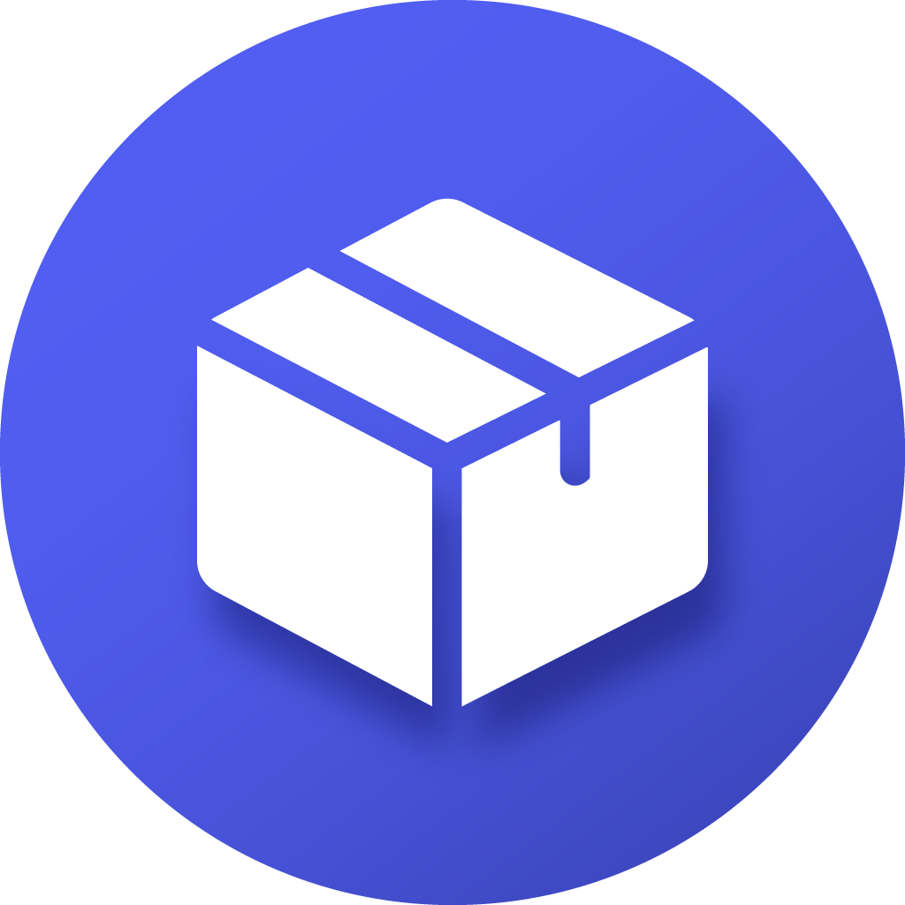
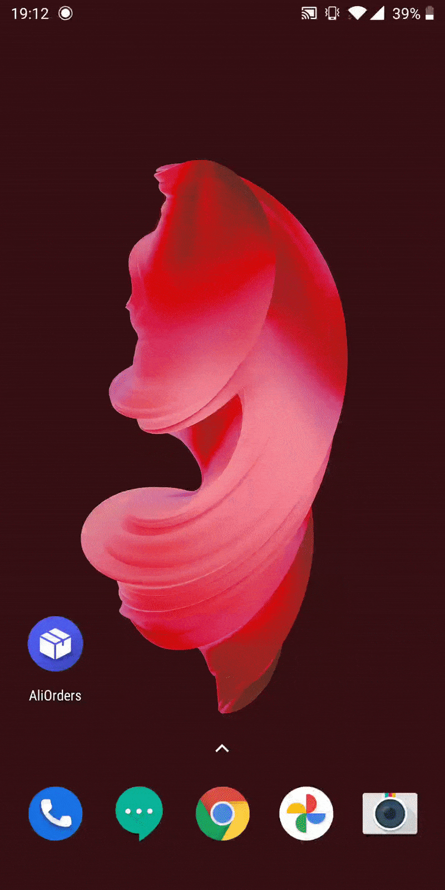
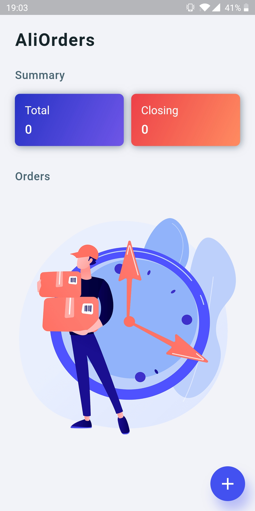
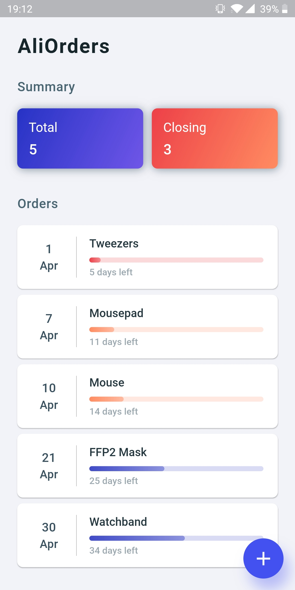
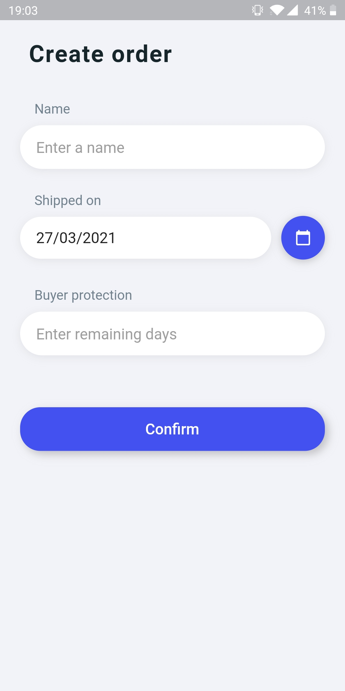
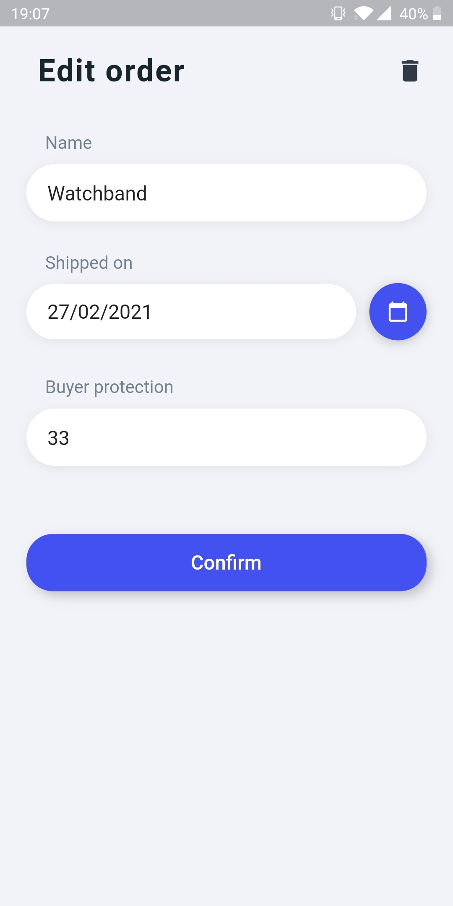
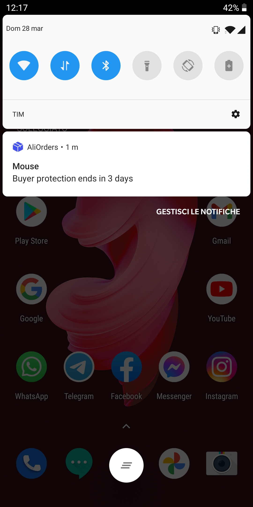

<br>
<p align="center">
  
</p>
<h1 align="center">AliOrders</h1>

**AliOrders** is a *mobile app* that helps you keep track of the buyer protection period of your *AliExpress* orders so you never forget about them. 

Having everything in one place is especially useful if you place orders from *multiple accounts* so you can take timely decisions (contact the seller or open a dispute) without having to check the *AliExpress* app and switch between your accounts very often.

## Features

* **Manage orders** - add orders, view a list sorted by closing date and delete them once they have been completed
* **Notifications** - receive notifications before (7 days, 3 days and 1 day) and after buyer protection ends

## Installation

* **(Method 1) Download the APK** 

    The APK can be downloaded from the [releases](https://github.com/AleG94/AliOrders/releases) section. This method works only with Android devices. 

* **(Method 2) Build a local copy** 

    To get a local copy up and running follow these steps:

    1. Install [Flutter](https://flutter.dev/docs/get-started/install)

    2. Clone the repo
        ```sh
        git clone https://github.com/AleG94/AliOrders
        ```

    3. Install dependencies
        ```sh
        flutter pub get
        ```

    4. Run project
        ```sh
        flutter run
        ```


## Screenshots

<p>
    
    
    
    
    
    
</p>

## Built with

- [Flutter](https://flutter.dev/) - Beautiful native apps in record time.
- [Android Studio](https://developer.android.com/studio/index.html/) - Tools for building apps on every type of Android device.
- [Visual Studio Code](https://code.visualstudio.com/) - Code editing. Redefined.

## Credits

- <div>Icons made by <a href="https://www.freepik.com">Freepik</a> from <a href="https://www.flaticon.com/">Flaticon</a></div>
- <div><a href="https://www.freepik.com/vectors/business">Courier</a> vector created by <a href="https://www.freepik.com/vectorjuice">vectorjuice</a> - <a href="https://www.freepik.com">Freepik</div>

